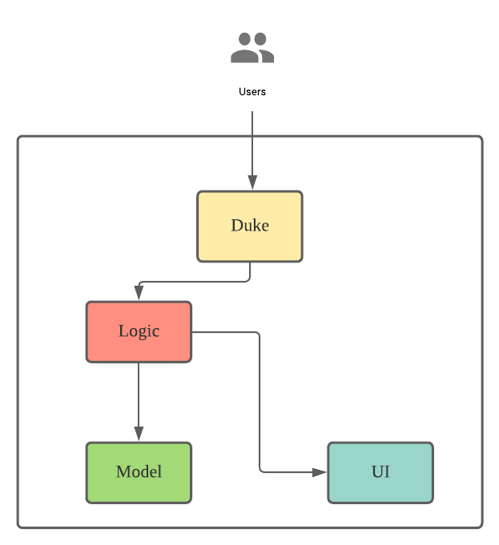
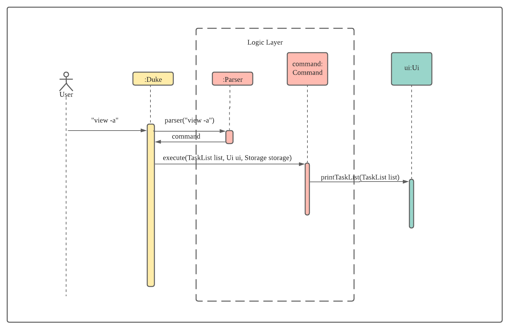

# Developer Guide

## Acknowledgements

{list here sources of all reused/adapted ideas, code, documentation, and third-party libraries -- include links to the original source as well}

## Design & implementation

### Architecture

The **_Architecture Diagram_** given above explains the high-level design of the App.

#### Main Class

Main component is the coordinator to handle user input and execute the corresponding task by interacting with logic
layer.

#### Logic Layer

This layer contains two main components, `Parser` and `Command`.

- Parser will parse user input and return a `Commnad` object to the caller which is `Main` class
- The `Command` will execute the tasks which corresponds to the user input. It will update the list of `Model`
  information and use `UI` component to print out relevant message.

#### Model Layer

- This layer consists a several `Task` models:

  - `Todo` task: the basic task which contains only the todo description and `done` status.
  - `Appointment` task: apart from the description and status, it also has `time` and `location` attributes.

- The system will generate a list of different `Task` to user.

#### UI Layer

- This layer is only for print different message for user based on the user input.

### Components Interaction

The sequence diagram blow shows how the components interact with each other to achieve desired result. This is taking
example of user input `view -a`.

From the sequence diagram, we can see that a user input `View -a` to and`Duke` class called `Parser.parse` method with the user input to get a `Command` object. The `execute` method of the `Command` object is called to carry out the task.

The reason of doing this is to decouple the parsing logic and task execution logic which is the implementation follows `Single Responsibility Principle`.

### Delete feature

It extends `Command` class. It checks if the number input by user is out of range. If yes, error thrown. If no, the task will be deleted from the `TaskList`. `Ui` will print the response.

### View feature

It extends `Command` class. If user input `-a` together with the command, `Ui` will print all the tasks in the `TaskList` together with the done status. If no, `Ui` will print all the **pending** tasks in the `TaskList` together with the done status.

### Mark as done feature

It extends `Command` class. It checks if the number input by user is out of range. If yes, error thrown. If no, change the status of the task to done [X].

## Product scope

### Target user profile

{Describe the target user profile}

### Value proposition

{Describe the value proposition: what problem does it solve?}

## User Stories

| Version | As a ... | I want to ...                                              | So that I can ...                     |
| ------- | -------- | ---------------------------------------------------------- | ------------------------------------- |
| v1.0    | user     | be able to delete a task if that task is not valid anymore | the task list is not cluttered        |
| v1.0    | user     | see the responses from Daffy after I enter commands        | know the commands are executed        |
| v1.0    | user     | be able to see all tasks                                   | plan my time                          |
| v2.0    | user     | be able to see unfinished tasks only                       | be more focus on the unfinished tasks |
| v2.0    | user     | mark tasks as done                                         | track the progress                    |

## Non-Functional Requirements

{Give non-functional requirements}

## Glossary

- _glossary item_ - Definition

## Instructions for manual testing

{Give instructions on how to do a manual product testing e.g., how to load sample data to be used for testing}
