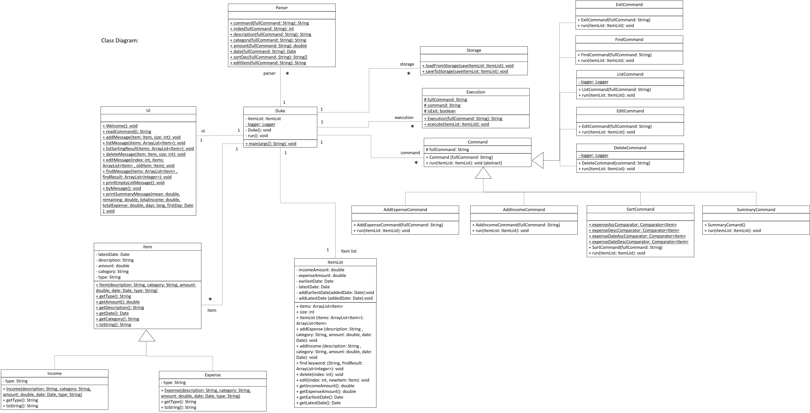

# Developer Guide

## Setting up, getting started
**Refer to the guide** <a href="https://github.com/AY2122S1-TIC4001-F18-2/tp/blob/master/README.md">Setting up and getting started.</a>

## Acknowledgements

{list here sources of all reused/adapted ideas, code, documentation, and third-party libraries -- include links to the original source as well}

## Design 

* *Architecture*
* *UI component* (CLI, Input/ Output)  
* *Logic component* (Execution, Command, Parser)
* *Model component* (Item, Expense, Income)
* *Storage component* (Storage)
* *Common classes* (ItemList)

1. Class diagram (refer to the image below).<br/>
        
2. Object diagram.<br/>
        
3. Sequence diagram.<br/>
        
   

## Implementation (Sequence Diagram)
* Search Command
* List Command
* Delete Command
* Add Command

## Documentation, logging, testing, (configuration, dev-ops)
* **Testing Guide**
* **Logging Guide**

## Appendix: Requirements

 * **Product scope** </br>
   ```Target user profile```

   Users who have the difficulty to record and manage the incomes and expenses

   ```Value proposition```

   * Keep track of the income and expense item
   * analysis daily / monthly expense

* **User Stories**

|Version| As a ... | I want to ... | So that I can ...|
|--------|----------|---------------|------------------|
|v1.0|new user|||
|v2.0|user|I need to do ascending or descending sorting by date|I can view the latest expenses|
|v2.0|user|I need to do ascending or descending sorting by expenses|I can view the highest expenses|
|v2.0|user|I need to put in my income|I can know how much I can spend|
|v2.0|user|I need to know when I spend and record enter time|I can check whether miss out any spend item|
|v2.0|user|I need to classify those spend item|I can know the spend category|
|v2.0|user|I need to able to delete added expense|I can delete if I add wrongly
|v2.0|user|I need to search items with keyword|I can view the specific item fast|
|v2.0|user|I need to save and read file|I can load the expenses/ salary data|


* **Use Cases**

      (For all use cases below, the System is the Expenses Tracking App and the Actor is the user, unless specified otherwise)

      Use case: Add Expenses

      Use case: Add Income

      Use case: Delete Item

      User case: Add Income

      Use case: List Item

      Use case: Find Item

* **Non-Functional Requirements**

  Should work on any mainstream OS as long as it has Java 11 or above installed.

* **Glossary**

  **Mainstream OS**:  Windows, Linux, Unix, OS-X

* **Instructions for manual testing**

   {Give instructions on how to do a manual product testing e.g., how to load sample data to be used for testing}
