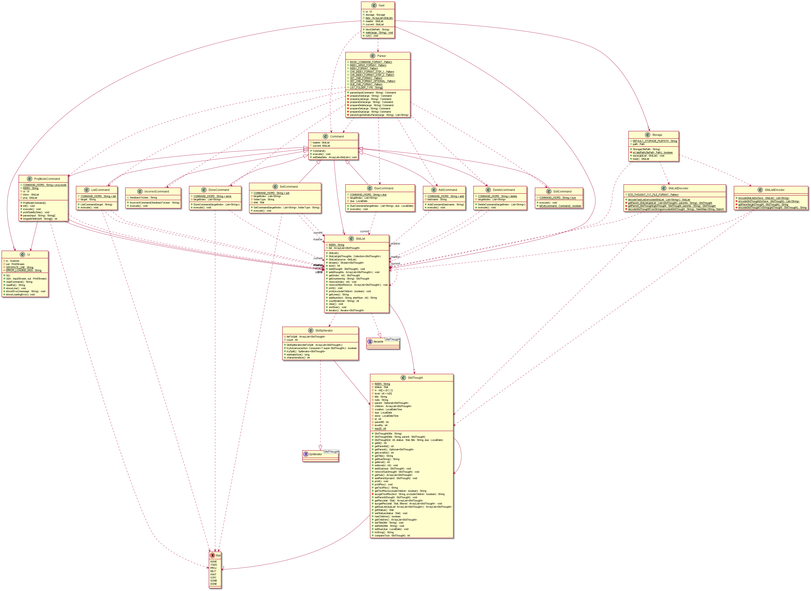

# Developer Guide

## Acknowledgements

Didn't use any 3<sup>rd</sup> party libraries.

Project's GitHub repository is available [here](https://github.com/AY2122S1-TIC4001-F18-3/tp).

## Design & implementation

`GtdThought` is a basic task data structure, which contains various properties that make sense to GTD flow:


```
public class GtdThought {
    private static final String INDEN = "  ";

    private Stat status = Stat.NONE;
    private final int[] lv = {0, 1, 2};
    private int level = lv[0];
    private String title;
    private String note;
    private Optional<GtdThought> parent = Optional.empty();
    private ArrayList<GtdThought> children = new ArrayList<>();
    private LocalDateTime creation;
    private LocalDateTime due;
    private LocalDateTime done;

    private int id;
    private int parentID = 0;
    private int levelNo = 0;

    public static int maxID = 0;
```
It has 3 levels from 0 - 2, which indicates its level of nesting. This is more clear when you print it out.

e.g.
```
1 a task in the Inbox with no subtask #lv 0
2 [PROJ] Project                      #lv 0
  2-1 [PROJ] SubProject 1             #lv 1
    2-1-1 [NEXT] actionable todo      #lv 2      
```

----

`GtdList` is the container that contains `GtdThought`, which also provides useful functionalities such as:

+ `get()` which can input a String such "1", "1-1", "1-2-1" to refer to the correct `GtdThought` 

+ `print()` to print out the `GtdList` with ref_no. and indentation based on their nesting level.


+ it's made to be streamable, just call `.stream()` then developers can use the frequent tools like `filter`, `map`, `reduce`, `forEach`.

----
The program also adopts Command Pattern,which all Command 
extends to parent `Command` class and must implement the `execute()` method.

### UML



## Product scope
### Target user profile
Daily GTD users who are enthusiastic about organizing tasks digitally and being exceptionally productive. 
Compared to tapping on the todo apps with GUI on their phones, they would prefer typing command lines for
speed of the batch editing and minimum visual distractions.

### Value proposition
Todo apps on the market generally target a broad customer base including light users, 
which means the learning curve is low and hard core features are hidden to not overwhelm the new users; 
They want the app to be flexible to accommodate more users who could use the app in their own ways, 
which results in difficulties to set up a proper GTD flow and clutters due to extra features; 
They have user-friendly interface and visual elements transiting with animation, 
those designs are key attractions to many, however, for power users, UI, gestures, 
animation may not be the most efficient and slower compared to old plain text entry.

The value offered by Project Next is to offer a quick text entry and batch editing command line REPL 
environment for the users who choose practicality over goofy aesthetics. Our product strictly follows 
the GTD method to provide handy guides and workflow to empower users to stick with the rhythm to check 
off tasks and accomplish life goals.

### User Persona

Alex is a 28-year old Project Manager who works at a software company. She overlooks multiple coding projects via GitHub. She is responsible to ensure all of them are on track to meet the release schedule. She often has an operational meeting in the morning to bring up daily deliverables and encountered issues. She meets and calls people in charge from different departments to check on the status of their work. If there is any issue in the progress, she may need to coordinate or make changes to the project planning.

Being a productivity guru in the company, she has always been researching for better ways to manage her daily tasks. Presently she is a Get Things Done (GTD) enthusiast. By practicing with the methodology originally introduced by David Allen, she feels very empowered that she could get more work done rather than filling more dead todos lying in a list forever.

Working in a tech company, she sure is tech savvy. She is constantly looking for new tools that would better suit her needs, e.g. enable her to note down ideas quickly, typing centric input experience etc.


## User Stories

|Version| As a ... | I want to ... | So that I can ...|
|--------|----------|---------------|------------------|
|v1.0|GTD user|add task quickly|I could offload my mental burdens|
|v1.0|GTD user|list down all incomplete tasks|I could review them and plan|
|v1.0|experienced user|delete old tasks|the app does not get cluttered with unnecessary data|
|v1.0|Todo app user|set a task as DONE at completion|I can see my progress on my task achievement|
|v1.0|GTD user|set actionable tasks in my Inbox as NEXT|those tasks get removed from Inbox and allow me to refer to the Next list for action|
|v1.0|GTD user|set the actionable tasks in my Inbox that cannot be performed by me until relevant resources from someone else as WAIT|review them again in one place once I obtain the deliverables from the person in charge|
|v2.0|GTD user|set the non-actionable tasks in my Inbox that cannot be done in one step as PROJ|later I could plan for each project and dismantle them into a sequence of actionable tasks|
|v2.1|GTD user|move actionable tasks from Inbox to be under a specific project which it belongs to|I could clear my Inbox and have tasks grouped in a logical way|
|v3.0|GTD user|set due date for a task|it get focused for attention at a later date|


## Non-Functional Requirements
+ program shouldn't just crash because user keys wrong words
+ program jar file should not rely on OS specific API, should run on OS with JDK 11 
+ program should exit if the save file is corrupted


## Glossary
+ *GTD* - [Get Things Done](https://todoist.com/productivity-methods/getting-things-done#what-is-gtd-a-brief-overview)
+ *GtdThought* - the data structure of a task which has a Status, can have parent GtdThought which holds it or hold multiple GtdThought as children
+ *GtdList* - a list that holds 0 to multiple GtdThought


## Instructions for manual testing

If run using the `jar` file, program starts clean with no pre-loaded data.

If clone the whole project directory, sample data would be included.

### install

1. Ensure that you have Java 11 or above installed
2. download the `.jar` file at [this link release V3.0](https://github.com/AY2122S1-TIC4001-F18-3/tp/releases/tag/v3.0)  put to desired directory
3. `cd` to the directory contains the `.jar` file
4. ```
   java -jar tp.jar
   ```

Alternative way of installing the program:
2. ```
   git clone https://github.com/AY2122S1-TIC4001-F18-3/tp.git
   ```
3. This way you will get pre-loaded sample tasks when start the program
4. You could open the folder as a project via IDE

### get started 
```
list all
list inbox
```

### add a task to inbox 
```
add this is a Task with Title
add wait for SetCommand before testing
add Use PlantUML for DG
add brew install graphviz 
add set up plugin in IDE
add one sequence diagram for ListCommand
add make UI for the app someday
```
### list [inbox, next, proj, wait, some, done]
```
list inbox
```
### set task status [next, proj, wait, some, done]
Actionable command following one `list` for ref_no.
```
set 3 proj
list inbox
set 1 3 next
list inbox
set 1 wait 
```
### move tasks from inbox to be under a project via `proj-mode`
Suggest do `set` to mark the top level projects (no indentation) from the Inbox first, prior to enter `proj-mode` for arrangement.
```
proj-mode
_________________________________________________
begin proj-mode >>>
use `#no #no .. -> #no` to move from left to right

inbox: ..................... proj:
1 issue#53v1 ............... 1 [PROJ] tp
2 merge PR about ListCmd ...... 1-1 [PROJ] features under me
3 write tp agenda wk11 ........ 1-2 [PROJ] PR review
4 call Alex ................... 1-3 [NEXT] call RT on parser
5 but cat food ............. 2 [PROJ] quarterly meeting

1 -> 1-1
2 3 -> 2

q
end proj-mode <<<
```
(the Exception handling for `proj-mode` yet made it into V3.0, incorrect arguments result in exiting `proj-mode` immediately)

### mark tasks done
another way to complete tasks other than `set` command.
Actionable command following one `list` for ref_no.

```
list proj
done 1-1-1 1-1-2
```
### delete task
Actionable command following one `list` for ref_no.

```
list proj
delete 1-2-1
```

### exit the program 

```
bye
```