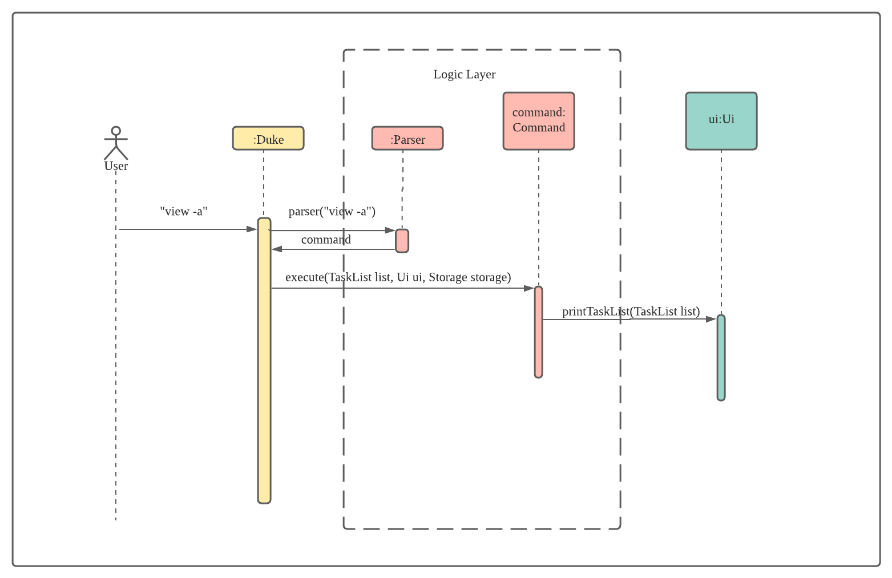

## Design & Implementation

### Architecture

The **_Architecture Diagram_** given above explains the high-level design of the App.

#### Main Class

Main component is the coordinator to handle user input and execute the corresponding task by interacting with logic
layer.

#### Logic Layer

This layer contains two main components, `Parser` and `Command`.

- Parser will parse user input and return a `Commnad` object to the caller which is `Main` class
- The `Command` will execute the tasks which corresponds to the user input. It will update the list of `Model`
  information and use `UI` component to print out relevant message.

#### Model Layer

- This layer consists a several `Task` models:

  - `Todo` task: the basic task which contains only the todo description and `done` status.
  - `Appointment` task: apart from the description and status, it also has `time` and `location` attributes.

- The system will generate a list of different `Task` to user.

#### UI Layer

- This layer is only for print different message for user based on the user input.

### Components Interaction

The sequence diagram blow shows how the components interact with each other to achieve desired result. This is taking
example of user input `view -a`.

From the sequence diagram, we can see that a user input `View -a` to and`Duke` class called `Parser.parse` method with the user input to get a `Command` object. The `execute` method of the `Command` object is called to carry out the task.

The reason of doing this is to decouple the parsing logic and task execution logic which is the implementation follows `Single Responsibility Principle`.
